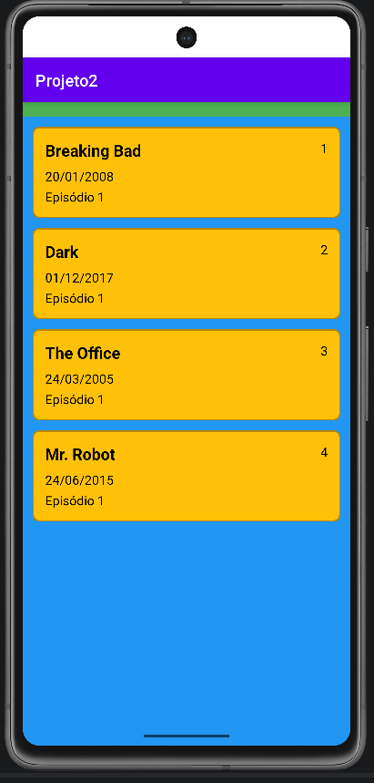

# Projeto2

Aplicativo Android desenvolvido em **Kotlin** que exibe uma lista de séries usando uma `RecyclerView` com um `Adapter` customizado.

## 📱 Demonstração

<p align="center">
  
</p>

## ✨ Funcionalidades

- Tela principal (`MainActivity`) construída com layout XML.
- `RecyclerView` para exibir a lista de itens (área azul).
- `Adapter` customizado responsável por desenhar cada item da lista (cards amarelos).
- Cada item mostra: **nome**, **id**, **data** e **episódio**.

## 🧩 Estrutura do projeto

```
app/src/main/
├── java/com/ricardo/projeto2/
│   ├── MainActivity.kt        # Configura a RecyclerView e liga o Adapter
│   ├── Serie.kt               # Modelo de dados (data class)
│   └── SerieAdapter.kt        # Adapter + ViewHolder
└── res/
    ├── layout/
    │   ├── activity_main.xml  # Tela principal (título + RecyclerView)
    │   └── item_serie.xml     # Layout de um item da lista (card amarelo)
    ├── drawable/
    │   └── bg_item_amarelo.xml
    └── values/
        └── colors.xml
```

## 🛠️ Tecnologias

- Kotlin
- Android SDK
- RecyclerView (AndroidX)

## 🚀 Como executar

1. Clone o repositório.
2. Abra o projeto no Android Studio.
3. Aguarde o Gradle sincronizar.
4. Rode o app em um emulador ou dispositivo físico.

---

Desenvolvido por [Ricardo Horie](https://github.com/ricardohorie07).
